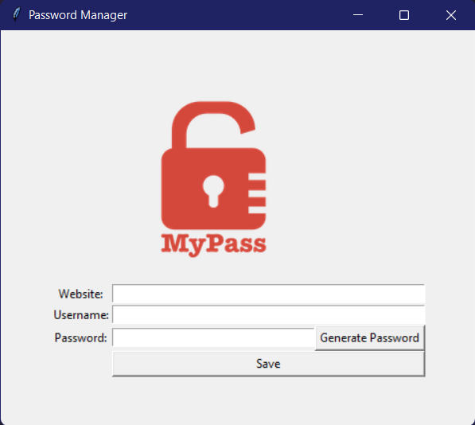

# Password Manager
[](https://www.python.org/)
> A simple password manager



## How to Use

---
To clone and run this application, you'll need Git and Python installed on your computer. From your command line:

```sh
# Clone this repository
git clone https://github.com/jeniferss/python.git

# Go into the repository
cd password_manager

# Create a Virtual Environment
python3 -m env C:/Users/youruser/pathtothisrepository/password_manager

# Open Virtual Environment
cd env

# Activate Virtual Environment
.\Scripts\activate

# Go back to the repository
cd ..

# Install requirements
pip install -r requirements.txt

# Run
python main.py
```


