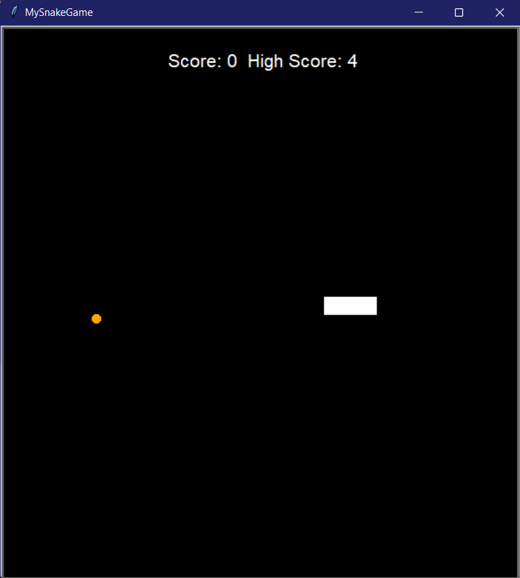

# My Snake Game
[](https://www.python.org/)
> Replication of the traditional game Snake 



## How to Use

---
To clone and run this application, you'll need Git and Python installed on your computer. From your command line:

```sh
# Clone this repository
git clone https://github.com/jeniferss/python.git

# Go into the repository
cd snake_game

# Run
python main.py
```


